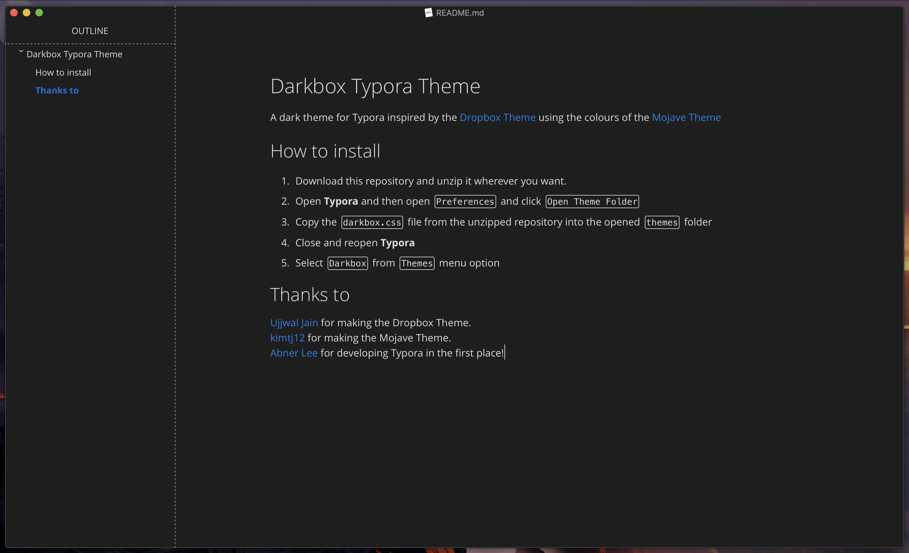

# Darkbox Typora Theme
A dark theme for Typora inspired by the [Dropbox Theme](https://theme.typora.io/theme/Dropbox/) using the colours of the [Mojave Theme](https://github.com/kimtj12/typora-mojave-theme)

**🚧STILL A WORK IN PROGRESS🚧**

## How to install
1. Download this repository and unzip it wherever you want.
2. Open **Typora** and then open `Preferences` and click `Open Theme Folder`
3. Copy the `darkbox.css` file from the unzipped repository into the opened `themes` folder
4. Close and reopen **Typora**
5. Select `Darkbox` from `Themes` menu option

## Thanks to
[Ujjwal Jain](https://github.com/ujwaljain) for making the Dropbox Theme.
[kimtj12](https://github.com/kimtj12) for making the Mojave Theme.
[Abner Lee](http://abnerlee.github.io) for developing Typora in the first place!

